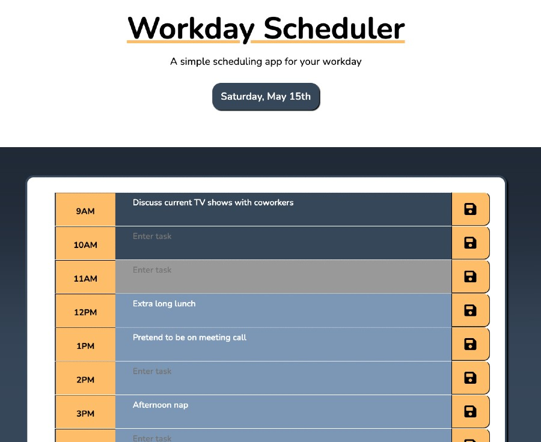

# workday-scheduler

A scheduling web application for keeping track of events throughout the day

See the project live here:
https://bpplaysguitar.github.io/workday-scheduler/

## Description
This workday scheduler taught me how tricky it can be to learn to use local storage, but how useful it is once I got the hang of it. I can see a many places where I'd want to utilize this. It was also my first time working with Luxon for time, and that is a neat tool as well. I wasn't aware anything like that even existed. Also quite powerful and I'm sure I have not even scratched its surface. It was nice to see how a couple new tools could come together to build something so familiar and seemingly simple.

## Installation

1. Provided that you have a code editor of your choosing installed on your system, such as VS Code (https://code.visualstudio.com/),

2. Provided that you have a Terminal installed for Windows (https://www.microsoft.com/en-us/p/windows-terminal/9n0dx20hk701?rtc=1&activetab=pivot:overviewtab) or are using a Mac with Terminal installed with the OS,

3. You have Git and Github Desktop installed (https://git-scm.com/downloads, https://desktop.github.com/) and have registered for an account,

4. Clone this repository:
git clone https://github.com/bpplaysguitar/workday-scheduler.git,

5. Create your own repository for the files on GitHub.

6. Edit in your code editor and continue to commit, push changes and perform other Git actions using your repository https://docs.gitlab.com/ee/gitlab-basics/start-using-git.html.

## Usage

Screenshot image of the project web page

## Credits

Profssional README guide template provided by Coding Boot Camp. https://github.com/coding-boot-camp

## License

MIT License

Copyright (c) 2021 Brian Palay

Permission is hereby granted, free of charge, to any person obtaining a copy
of this software and associated documentation files (the "Software"), to deal
in the Software without restriction, including without limitation the rights
to use, copy, modify, merge, publish, distribute, sublicense, and/or sell
copies of the Software, and to permit persons to whom the Software is
furnished to do so, subject to the following conditions:

The above copyright notice and this permission notice shall be included in all
copies or substantial portions of the Software.

THE SOFTWARE IS PROVIDED "AS IS", WITHOUT WARRANTY OF ANY KIND, EXPRESS OR
IMPLIED, INCLUDING BUT NOT LIMITED TO THE WARRANTIES OF MERCHANTABILITY,
FITNESS FOR A PARTICULAR PURPOSE AND NONINFRINGEMENT. IN NO EVENT SHALL THE
AUTHORS OR COPYRIGHT HOLDERS BE LIABLE FOR ANY CLAIM, DAMAGES OR OTHER
LIABILITY, WHETHER IN AN ACTION OF CONTRACT, TORT OR OTHERWISE, ARISING FROM,
OUT OF OR IN CONNECTION WITH THE SOFTWARE OR THE USE OR OTHER DEALINGS IN THE
SOFTWARE.
